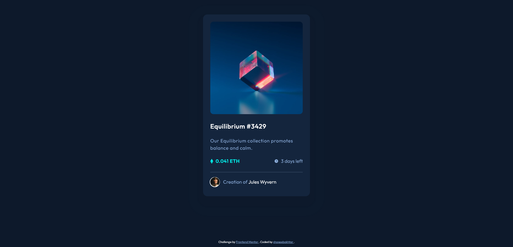

# Frontend Mentor - NFT preview card component solution

This is a solution to the [NFT preview card component challenge on Frontend Mentor](https://www.frontendmentor.io/challenges/nft-preview-card-component-SbdUL_w0U).

## Table of contents

- [The challenge](#the-challenge)
- [Screenshot](#screenshot)
- [Links](#links)
- [Built with](#built-with)
- [Author](#author)

### The challenge

Users should be able to:

- View the optimal layout depending on their device's screen size
- See hover states for interactive elements

### Screenshot

### Links

- Solution URL: [Github](https://github.com/shaqeebakhtar/NFT-preview-card)
- Live Site URL: [Netlify](https://frontendmentor-nft-card.netlify.app/)

### Built with

- Semantic HTML5 markup
- CSS custom properties
- CSS Grid

## Author

- Github - [shaqeebakhtar](https://github.com/shaqeebakhtar)
- Twitter - [@shaqeeb_akhtar](https://www.twitter.com/shaqeeb_akhtar)
- Frontend Mentor - [@shaqeebakhtar](https://www.frontendmentor.io/profile/shaqeebakhtar)
